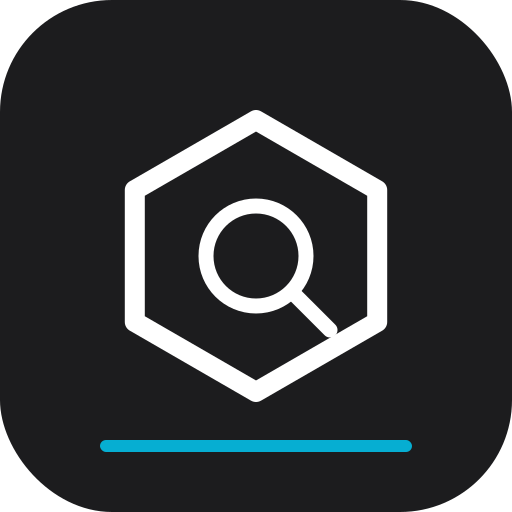
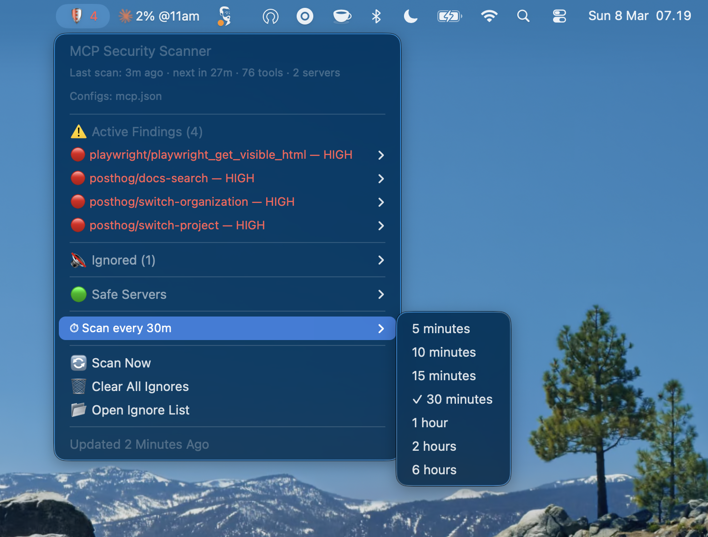
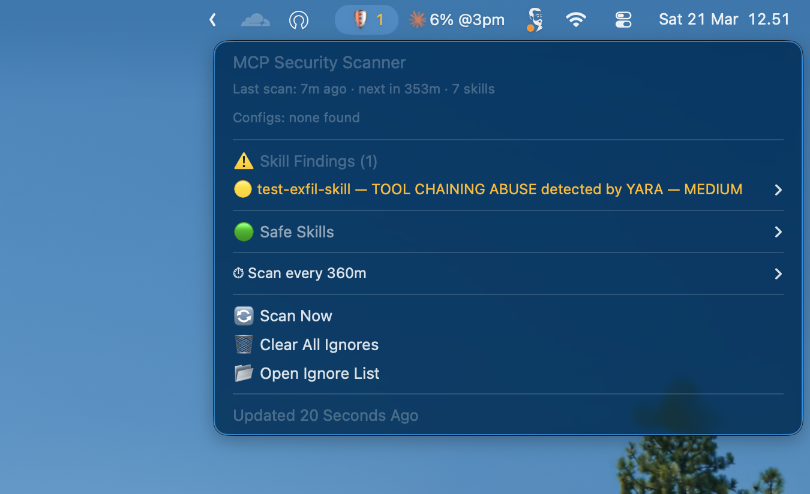

# MCP Scan Bar

<p align="center">
  
</p>

macOS menu bar plugin that shows security findings from [Cisco's mcp-scanner](https://github.com/cisco-ai-defense/mcp-scanner) and [skill-scanner](https://github.com/cisco-ai-defense/skill-scanner) — unified visibility for both MCP servers and AI agent skills.

   

<p align="center">
  
  
</p>

## What it scans

| Scanner | What it checks | Install |
|---------|---------------|---------|
| **mcp-scanner** | MCP server configs (`claude_desktop_config.json`, `mcp.json`, etc.) | Required |
| **skill-scanner** | AI agent skills (Cursor, Claude, Codex, Cline, etc.) | Optional |

Both scanners are by [Cisco AI Defense](https://github.com/cisco-ai-defense). If `skill-scanner` is not installed, the plugin works in MCP-only mode.

## What it shows

**Menu bar:**

```
🛡️ ✓          <- all clear (green)
🛡️ 2          <- 2 high/critical findings (red)
🛡️ 1          <- 1 medium finding (yellow)
```

The icon reflects the combined threat count from both scanners.

**Dropdown:**

```
MCP Security Scanner
Last scan: 5m ago · next in 25m · 42 tools · 8 servers · 7 skills
Configs: claude_desktop_config.json, mcp.json

⚠️ MCP Findings (2)
  🔴 someserver/tool_name — HIGH
    Data Exfiltration Attempt
    Ignore this finding
  🟡 another/tool — MEDIUM
    Prompt Injection
    Ignore this finding

⚠️ Skill Findings (1)
  🟡 my-skill — TOOL CHAINING ABUSE detected by YARA — MEDIUM
    Category: tool_chaining_abuse
    Rule: YARA_tool_chaining_abuse_generic
    Ignore this finding

🔇 Ignored (1)
  playwright/assert_response — LOW
    Restore this finding

🟢 Safe Servers
  context7: 2 tools ✓
  supabase: 15 tools ✓

🟢 Safe Skills
  fastapi ✓
  slidev ✓

🔄 Scan Now
🗑️ Clear All Ignores
📂 Open Ignore List
---
⏱ Scan every 30m
     5 minutes
     10 minutes
     15 minutes
  ✓  30 minutes
     1 hour
     2 hours
     6 hours
```

Finding colors: red (high/critical), yellow (medium), green (low).

## Quick Install

```bash
bash <(curl -fsSL https://raw.githubusercontent.com/naufalafif/mcpscan-swiftbar/main/setup.sh)
```

Or clone and run:

```bash
git clone git@github.com:naufalafif/mcpscan-swiftbar.git
cd mcpscan-swiftbar
bash setup.sh
```

The setup installs both `mcp-scanner` (required) and `skill-scanner` (optional — warns but continues if it fails).

## Configuration

Settings are stored in `~/.config/mcp-scan/config`:

```bash
SCAN_INTERVAL=30  # Scan interval in minutes

# Optional: colon-separated list of directories to scan for skills.
# If not set, defaults to common agent skill directories:
#   ~/.cursor/skills, ~/.cursor/rules, ~/.claude/skills,
#   ~/.agents/skills, ~/.codex/skills, ~/.cline/skills,
#   ~/.opencode/skills, ~/.continue/skills, ~/.gemini/skills
SKILL_DIRS="$HOME/Workspace/my-projects:$HOME/.agents/skills"
```

**Scan interval** can also be changed from the dropdown menu (⏱ at the bottom).

## How the scan interval works

There are two timers at play:

| Timer | What it does | Default |
|-------|-------------|---------|
| **SwiftBar refresh** (filename `5m`) | Re-runs the script to update the display | Every 5 minutes |
| **Scan interval** (configurable) | How often the scanners actually run | Every 30 minutes |

The script runs every 5 minutes but only fires the scanners when cached results are older than the configured scan interval. Both scanners run in parallel in the background. Clicking **Scan Now** bypasses the cache immediately.

## What the setup does

1. Installs [SwiftBar](https://github.com/swiftbar/SwiftBar) (if not present)
2. Installs [uv](https://github.com/astral-sh/uv) via Homebrew (if not present)
3. Installs [mcp-scanner](https://github.com/cisco-ai-defense/mcp-scanner) via `uv tool install`
4. Installs [skill-scanner](https://github.com/cisco-ai-defense/skill-scanner) via `uv tool install` (optional)
5. Copies the SwiftBar plugin to `~/Plugins/SwiftBar/`
6. Initializes the ignore list at `~/.cache/mcp-scan/ignore.json`
7. Creates default config at `~/.config/mcp-scan/config`
8. Launches SwiftBar

## Prerequisites

- macOS
- [Homebrew](https://brew.sh)
- Python 3 (comes with macOS)

## How it works

- Runs Cisco's `mcp-scanner` with YARA analysis on your known MCP config files
- Runs Cisco's `skill-scanner` on configured skill directories (if installed)
- Both scans run in parallel in the background — SwiftBar stays responsive
- Caches results at `~/.cache/mcp-scan/last-scan.json` and `last-skill-scan.json`
- Click **Scan Now** to trigger an immediate rescan of both
- Ignore individual findings — they persist across scans in `~/.cache/mcp-scan/ignore.json`
- MCP and skill findings use separate namespaces (`server:tool` vs `skill:name:rule_id`) so ignores never collide

## Files

| File | Description |
|------|-------------|
| `setup.sh` | One-command installer |
| `mcp-scan.5m.sh` | SwiftBar plugin (reference copy — setup copies this to the plugin directory) |

## Uninstall

```bash
rm ~/Plugins/SwiftBar/mcp-scan.5m.sh
rm -rf ~/.cache/mcp-scan
rm -rf ~/.config/mcp-scan
brew uninstall --cask swiftbar  # optional
uv tool uninstall cisco-ai-mcp-scanner  # optional
uv tool uninstall cisco-ai-skill-scanner  # optional
```

## License

MIT
